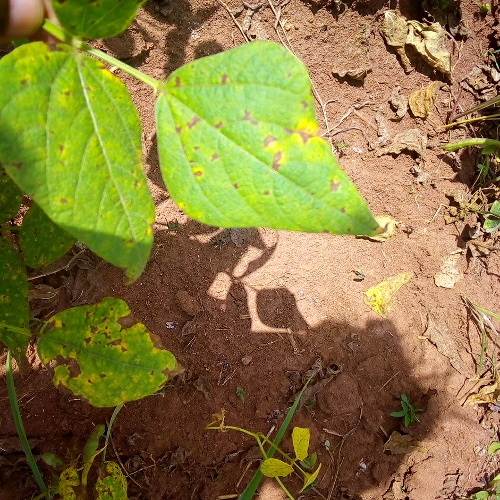
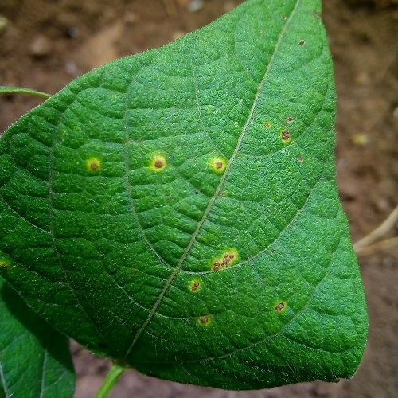
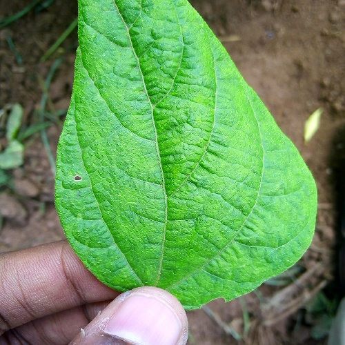
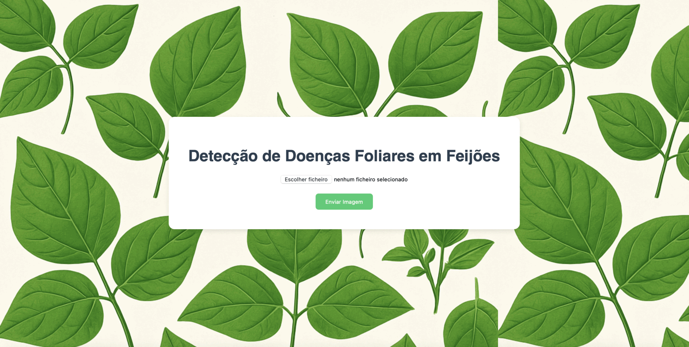

# Detection of Leaf Diseases in Beans 🌱🫘

This project develops a Django-based web interface that performs foliar disease detection on bean leaf images, classifying them as having spots, rust, or being healthy. The system integrates Mistral-7B-OpenOrca, a Large Language Model (LLM), which generates explanatory responses based on the classification results, providing a detailed diagnosis of the plant’s foliar health. By facilitating early detection of foliar diseases, the project offers an interactive and accessible solution for agricultural monitoring.

# About Classification
A MobileNet was trained using the [Bean Leaf Lesions Classification dataset](https://www.kaggle.com/datasets/marquis03/bean-leaf-lesions-classification) which includes the categories "healthy", "angular leaf spot", and "bean rust". The dataset contains 1034 images in the training set and 133 images in the calibration set, totaling 155 MB. This dataset can be used for training and evaluating machine learning models aimed at recognizing lesions on legume leaves.

<p align="center">
  
  
  
</p>

# Get Started 🚀
- To run the application, it is recommended to use a Python environment as some libraries will need to be installed.Initially, run the following command:

```
pip install -r requirements.txt
```
- To start the application, simply execute the following command:
```
python manage.py runserver
```
The following theme will be displayed, then simply upload an image you wish to evaluate.  Access the route ``http://localhost:8000/home-page/`` and you will see the following page:
<br>


# Contributing

1. Fork the repository.
2. Create a branch for your changes (`git checkout -b feature/new-feature`).
3. Commit your changes (`git commit -am 'Add new feature'`).
4. Push to the branch (`git push origin feature/new-feature`).
5. Open a pull request.

# Contact

- **Email**: colaresmarcelo2022@gmail.com
- **LinkedIn**: [engmarcelocolares](https://www.linkedin.com/in/engmarcelocolares/)

